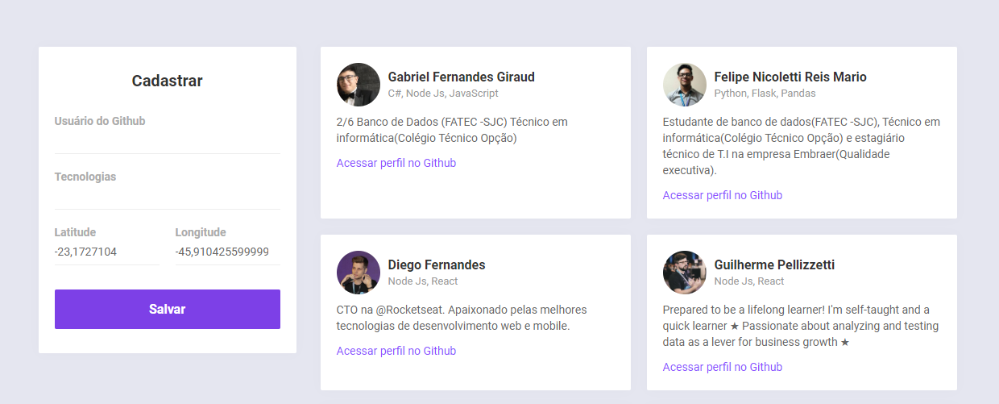
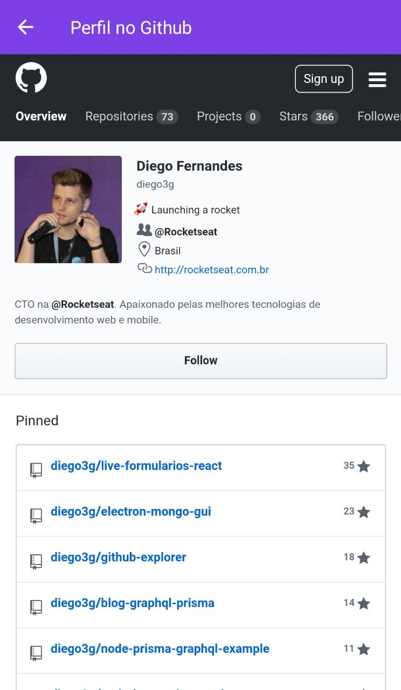
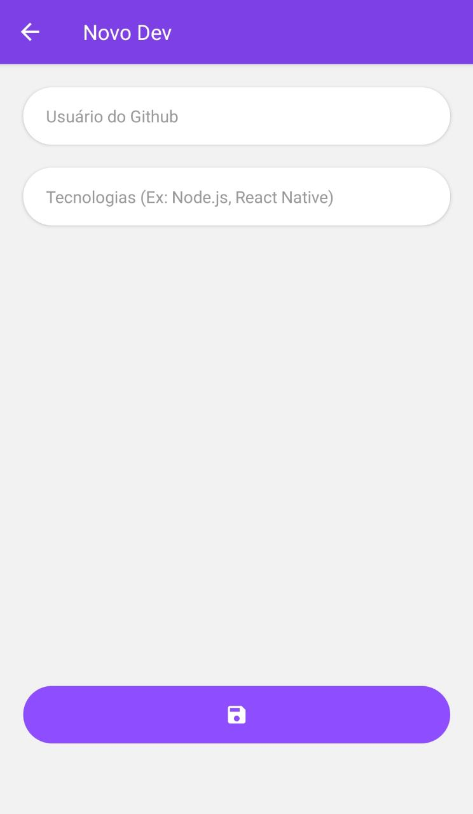

# Repositório da Semana Omnistack 10
# Skills:
- Node.js
- React 
- React Native
- MongoDb
- WebSocket
- API Rest

# Requisitos:
- Node.js
- Yarn
- Git
- Expo

# Para executar:
`git clone https://github.com/giraudgabriel/Multiroom-Chat.git`
<br>
<br>
# Web:
```
cd web
yarn install
yarn start
```



<br>

# Mobile:
```
cd mobile
yarn install
yarn start
```




<br>
# Backend:
```
cd backend
yarn install
yarn dev
```

